# Reconnaissance de la lanue des signes

## Contexte du projet: 

Beaucoup de progrès et de recherches en IA ont été faites pour aider les personnes sourdes et muettes. L'apprentissage profond et la vision par ordinateur peuvent également être utilisés pour avoir un impact sur cette cause.

Cela peut être très utile pour les personnes sourdes et muettes dans la communication avec les autres car la connaissance de la langue des signes n'est pas quelque chose qui est commun à tous, de plus, cela peut être étendu à la création des éditeurs automatiques, où la personne peut facilement écrire par ses simples gestes .

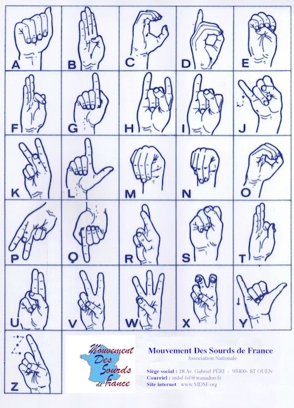

## Préparation du travail:
La première étape de ce projet a été de créer le dataset d'images qui allait nous servir de base d'entrainement pour notre modèle.
Ainsi chaque groupe s'est pris en photos en signant chaque lettre de l'alphabet.

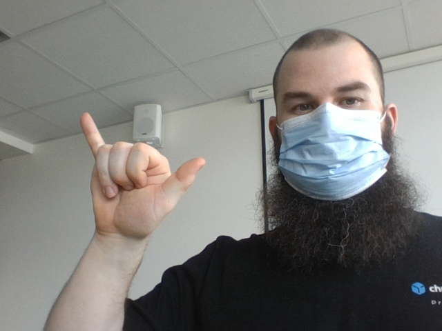

Une fois toutes les images mises en commun, le traitement a pu commencer. 

## Traitement des images:

Pour ce faire, nous avons utilisé Mediapipe. Le principe est de placer des keypoints (ou landmarks) sur différentes parties du corps (mains, visage, ...). Dans notre cas, chaque keypoint était placé sur la main.

En conditions réelles, cela donne :

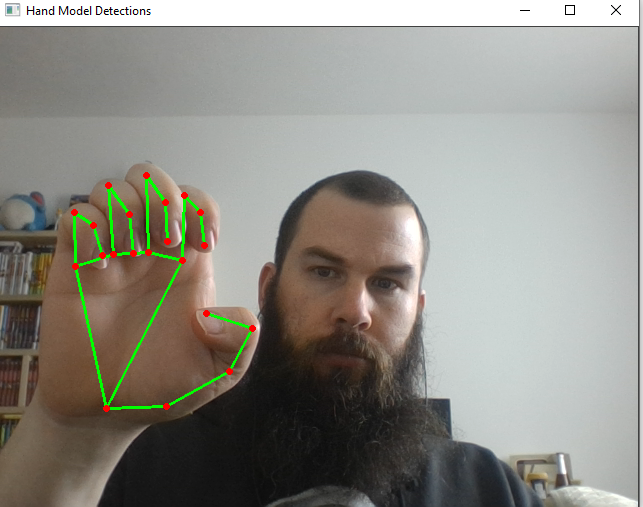

Pour commencer nous avons regroupé toutes les images dans un seul dossier. Nous avons donc commencé avec 1694 images.

Chacune de ces images a été traité par Mediapipe afin de déterminer l'emplacement de la main et ainsi d'y placer les landmarks. Nous avons donc récupéré 2 listes: une première avec le nom des fichiers pour lesquels des landmarks ont pu être placés et une autre avec les coordonnées 3D (x, y, z) de chaque points. A la sortie nous n'avions plus que 794 images. La diminution de plus de la moitier est probablement dûe au fait que tous les signes ne soient pas fait de la même main et que pour des images, les mains ne soient pas très visibles. Lorsque que l'on regarde le nom des fichiers finaux, on se rend compte qu'il manque des images par bloc de lettre, voir par personne (par exemple, les 120 premières images n'ont pas été labellisées). 
 Une fois le traitement terminé, un fichier csv est fait avec les coordonnées des points et la lettre à laquelle l'image correspond.

## Entrainement du modèle

Tout d'abord, il a fallu retirer la colonne des index du fichier csv afin de n'avoir que les coordonnées et la classe correspondante. 
A cause du faible nombre d'images, le test_size a été fixé à 30% lors du split. Un premier tes avait été fait avec 20% mais du coup certaine classes étaient peu représentée et il arrivait donc que le modèle n'arrive pas du tout à prédire une lettre. Avec 30%, ce problème est moins présent. 

Ensuite les classes ont été label encodé.

A la sortie nous obtenons une accuracy de 61% mais avec une stabilité moyenne: plus on se rapprochait des dernières epochs, plus l'accuracy jouait au 'yoyo'.

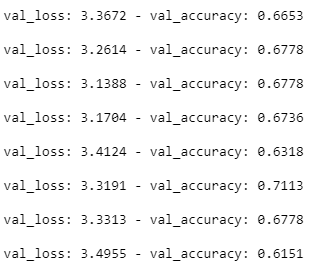

61% peut parraître faible comme résultat mais cela est suffisant pour avoir une bonne reconnaissance en vidéo. Ce résultat peut s'expliquer par la forte ressemblance entre les lettres, comme par exemple :
* 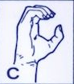 et 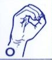
* 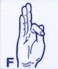 et 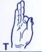
* 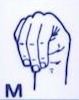 et 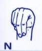

## Test en vidéo:
Cette partie est très similaire à celle du début qui nous a permis de nous familiariser avec mediapipe et de mettre en place les keypoints sur les images.

Cette partie se découpe en plusieurs phases:

* Côté affichage
    * la vidéo est affichée
    * les keypoints de la main droite sont affichés
    * la lettre prédite est affichée sur la droite de la fenêtre 
    * la phrase ainsi écrite est affichée en bas de la fenêtre
* Côté 'code'
    * l'image ou frame est passée en RGB pour permettre son traitement par Mediapipe
    * elle est traitée avec Mediapipe
    * via les coordonnées des keypoints, une lettre est prédite
    * cette lettre est stockée dans une liste vide
    * lorsqu'une lettre apparaît 15 fois dans la liste, celle-ci est ajoutée à la phrase et la liste est vidée pour procéder à l'enregistrement de la lettre suivante
    * enfin l'image est remise en BGR pour être traitée par cv2 et être affichée

Sans le repassage en BGR cela donnerait

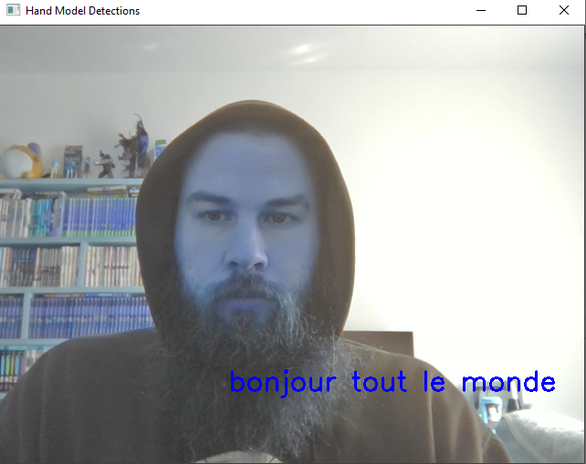

Pour simplifier cette phase, nous avons mis en places 3 touches:
* **espace** pour faire un espace dans la phrase
* **a** pour annuler la dernière lettre affichée
* **q** pour quitter la capture vidéo

Au final nous obtenons ceci

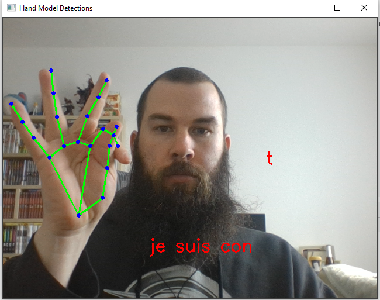

### Problèmes rencontrés:

* le fait que tout le monde ne signe pas de la même main 
    * pour pallier à cela il faudrait faire en sorte que le modèle apprenne avec des coordonnées de keypoints inversées
* tout le monde n'a pas utilisé la même base de signe du coup pour certaine lettre, il y a 2 voire 3 représentations différentes
* le nombre total d'images avant et après traitement par Mediapipe n'est pas très élevé
    * on pourrait soit faire une nouvelle série d'images pour augmenter le jeu d'images ou encore faire de la data augmentation (le problème étant comme pour le fait de signer avec les 2 mains, sur un flip horizontal, il faudrait que les 2 positions soient acceptées.)
 * par facilité et manque de temps, le système de suppression de lettre et d'espace se fait via le clavier. Le but final étant de pouvoir travailler sans clavier, il serait bien de mettre en place soit un signe pour faire un espace, soit un endroit dans la fenêtre qui nous permettrait en y laissant la main ou un doigt un certain de faire un espace ou de supprimer la dernière lettre.

### Remerciements

Un grand merci à @FurigaJulien pour l'aide qu'il a apporté dans l'accomplissement de ce projet
